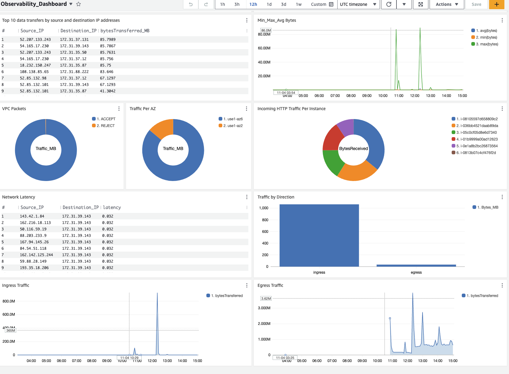

# Terraform Infrastructure for CloudWatch Dashboard



This Terraform repository is designed to create and manage CloudWatch Dashboards using CloudTrail logs and VPC Flow logs. The infrastructure can be customized to include log group creation if not already in place.

## Prerequisites

Before you begin, ensure you have the following prerequisites:

- AWS account and access keys with necessary permissions for Terraform to create resources.
- Terraform installed on your local machine.

## Getting Started

1. Clone this repository to your local machine:

   ```bash
   git clone git@github.com:emreoztoprak/cloudwatch-dashboard-vpc-and-account-activity.git
   ```

2. Change to the repository directory:

   ```bash
   cd cloudwatch-dashboard-vpc-and-account-activity
   ```

3. Initialize the Terraform workspace:

   ```bash
   terraform init
   ```

4. Create a Terraform variable file (e.g., `terraform.tfvars`) and specify the following variables:

   - `create_cloudtrail` and `create_vpc_flow_logs` set to `true` or `false` based on your preference to create CloudTrail and VPC Flow log groups.
   - Specify log group names if you have log groups already (`cloudtrail_log_group_name` and `vpc_flow_logs_name`).

   Example `terraform.tfvars` if you want to create CloudTrail and VPC Flow log groups with Cloudwatch Dashboards :

   ```hcl
    create_cloudtrail = true

    create_vpc_flow_logs = true
    
    vpc_id = "vpc-id"

    region = "us-east-1"
   ```
    
    Example `terraform.tfvars` if you have CloudTrail and VPC Flow log groups already and just want to create Cloudwatch Dashboards :

   ```hcl
    create_cloudtrail = false

    create_vpc_flow_logs = false

    cloudtrail_log_group_name = "cloudtrail-log-group-name"

    vpc_flow_logs_name = "vpc-flow-log-group-name"

    region = "us-east-1"
   ```
5. Apply the Terraform configuration to create the resources:

   ```bash
   terraform apply
   ```

## Dashboard Configuration

This Terraform configuration creates a CloudWatch dashboard with the following widgets:

- IAM Policy Changes
- IAM User-Group-Role Changes
- Failed Console Login
- Denied Accesses
- Denied Accesses by Service
- Denied Accesses by User
- Root Account Activity
- SSM Sessions
- Security Group Changes
- NACL Changes
- Access Key Changes
- S3 Policy Changes
- Top 10 Source IP Address
- Top 10 Destination IP Address
- Top 10 Source Rejected IP Address
- Top 10 Destination Rejected IP Address
- Rejected Packets
- Accepted Packets
- VPC Packets
- Top 10 data transfers by source and destination IP addresses
- Traffic Per AZ
- Min_Max_Avg Bytes
- Network Latency
- Incoming HTTP Traffic Per Instance
- Traffic by Direction
- Ingress Traffic
- Egress Traffic

## Customization

You can customize the dashboard and its widgets by modifying the `cloudwatch_dashboards` module in this repository.

## Cleaning Up

To destroy the resources and clean up the infrastructure:

```bash
terraform destroy
```

## Contributing

If you'd like to contribute to this project, please follow the standard GitHub workflow for pull requests and issues.

## License

This project is licensed under the GPL-3.0 License - see the [LICENSE](LICENSE) file for details.